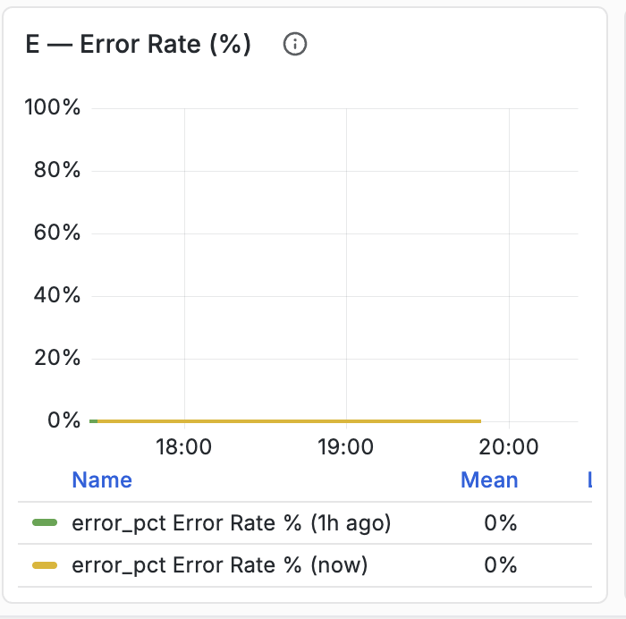

# 使用[!DNL Synoptryx]的应用程序性能监控(APM) {#application-performance-monitoring}

[!DNL Synoptryx]应用程序性能监控(APM)提供实时和历史insight到Adobe [!DNL Experience Manager] (AEM)性能和最终用户体验的转换。 通过端到端事务跟踪、图表和报告，可以深入了解Java代码级别的应用程序行为。

## Managed Services [!DNL Synoptryx] APM插件 {#apm-plugin}

AEM作为Java应用程序在Jetty上运行，带有Apache Felix OSGi模块，基于Apache Sling和Jackrabbit Oak构建。 Adobe Managed Services、AEM工程和[!DNL Synoptryx]工程部门联合开发了Managed Services环境的自定义工具。

该工具收集：

- **有意义的事务命名** — Sling扩展将事务名称与页面结构保持一致，并在Insights事件中添加`requestURL`属性，以便您可以跨功能板关联Sling URL。


- **JCR检测** — 存储库级别的操作（包括XPath和JCR-SQL2）在APM的数据库部分中分类并附加到事务跟踪。


## 使用[!DNL Synoptryx] APM {#using-apm}

使用APM在应用程序问题影响最终用户之前查找它们。 创作和发布共享一个代码库，但作为&#x200B;**单独的APM应用程序**&#x200B;进行监视，因此您可以单独分析每个层。

每个Managed Services环境都包括：

- 一个APM应用程序供作者使用
- 一个APM应用程序用于发布

在[!DNL Synoptryx] APM中选择应用程序名称以打开其概述和监视仪表板。


## 仪表板节

“应用程序性能管理”仪表板包含以下部分：

- 概述
- 红色量度（比率·错误·持续时间）
- 流量
- 延迟和性能
- 错误详细信息
- 热门事务
- JVM运行状况
- JVM 内存
- 垃圾回收

本指南中仅记录以下章节。

## 仪表板导航


仪表板分为多个可扩展部分，这些部分将相关的应用程序性能量度分组。 展开某个部分将显示与该类别关联的一个或多个图表。

## 概述


### 描述

**[!UICONTROL 概述]**&#x200B;部分显示汇总受监视应用程序的当前状态的高级关键绩效指标(KPI)。

这些KPI提供了应用程序活动、吞吐量、请求成功和整体用户体验的概览摘要。

### 量度

#### 请求总数

显示应用程序在所选时间范围内处理的请求总数。

**指标**

```
total_requests
```

**单位**

- 计数

#### 当前吞吐量

显示当前的请求处理率。

**指标**

```
throughput
```

**单位**

- 每秒请求数（请求）

#### 当前错误率

显示导致错误的请求百分比。

**指标**

```
error_rate
```

**单位**

- 百分比(%)

#### APDEX分数

显示应用程序绩效指数(APDEX)，这是根据应用程序响应时间对最终用户满意度的标准化衡量。

配置的阈值将显示在小组件中。

**指标**

```
apdex_score
```

**单位**

- 分数(0.0 - 1.0)

## 红色量度

RED方法测量应用程序的三个主要特征：

- **费率**
- **个错误**
- **持续时间**

### 请求率


#### 描述

显示一段时间内收到的应用程序请求数。

此图表使用时间序列可视化图表来表示请求吞吐量。

#### 量度

```
req_min
```

#### 单位

- 每分钟请求数（请求/分钟）

#### 显示的信息

- 时间序列请求率
- 历史请求活动
- 请求率趋势
- 量度图例

### 错误率



#### 描述

显示导致错误的请求百分比。

图表比较了历史错误百分比和当前错误百分比。

#### 量度

```
error_pct (now)
error_pct (1h ago)
```

#### 单位

- 百分比(%)

#### 显示的信息

- 当前错误百分比
- 历史比较
- 平均值
- 时间序列趋势

### 请求持续时间


#### 描述

显示跨多个响应时间百分位数的请求延迟。

该图表同时绘制在选定观察期间收集的百分位延迟测量值。

#### 量度

```
P50
P75
P90
```

#### 件数

- 毫秒（毫秒）
- 秒

设备会根据响应持续时间自动缩放。

#### 显示的统计信息

对于每个百分位数：

- 平均值
- 过去
- 最大值

#### 百分位定义

| 量度 | 描述 |
| ------ | ----------------------------- |
| P50 | 第50百分位响应时间 |
| P75 | 第75百分位响应时间 |
| P90 | 第90百分位响应时间 |

## 流量

### 按HTTP状态代码显示的请求


#### 描述

显示按HTTP响应状态代码分组的请求吞吐量。

每个状态代码都会随时间独立绘制。

#### 量度

常见量度包括：

```
req_s 200
req_s 300
req_s 400
req_s 500
```

取决于应用程序活动。

#### 单位

- 每秒请求数（请求）

#### 显示的信息

- 按HTTP状态显示的吞吐量
- 平均吞吐量
- 最新吞吐量
- 最大吞吐量
- 时间序列活动

### 按终结点显示的请求速率

终结点

#### 描述

显示按请求率排名的最高流量应用程序端点。

每个端点都显示为表示请求数量的水平条。

#### 量度

```
endpoint_request_rate
```

#### 单位

- 每分钟请求数（请求/分钟）

#### 显示的信息

- 端点路径
- 请求率
- 排名端点列表
- 相对请求量

## 延迟和性能

### 响应时间 — P95与1小时


#### 描述

显示当前P95响应时间与前一小时记录的P95响应时间的比较。

两个数据集都显示在同一个时间序列图上。

#### 量度

```
P95 (Current)
P95 (1 Hour Ago)
```

#### 件数

- 毫秒（毫秒）
- 秒

#### 显示的统计信息

- 平均值
- 过去
- 最大值

### 随时间变化的APDEX分数


#### 描述

将应用程序性能指标显示为连续的时间序列。

该图形显示所选监视间隔内的APDEX值。

#### 量度

```
APDEX Score
```

#### 单位

- 分数(0.0-1.0)

#### 显示的统计信息

- 平均值
- 过去
- 最大值

### 吞吐量与P95延迟


#### 描述

在同一时间线上显示请求吞吐量和P95响应延迟。

该图表可同时实现流量和响应延迟的可视化。

#### 量度

```
Throughput
P95 Latency
```

#### 件数

| 量度 | 单位 |
| ----------- | ------------ |
| 吞吐量 | 请求数/秒 |
| P95延迟 | 毫秒 |

#### 显示的信息

- 时间序列吞吐量
- 时间序列延迟
- 双重量度比较

## 错误详细信息

### 错误率%（按状态组）


#### 描述

显示按HTTP响应类分组的应用程序错误百分比。

为每个响应类别绘制单独的系列。

#### 量度

常见组包括：

```
2xx
3xx
4xx
5xx
Combined Error Trend
```

取决于观察到的流量。

#### 单位

- 百分比(%)

#### 显示的信息

- 按响应类排列的错误百分比
- 平均错误百分比
- 时间序列趋势


### 错误率趋势 — 现在与1小时前


#### 描述

显示当前应用程序错误率和前一小时记录的错误率。

#### 量度

```
Current Error Ratio
1 Hour Error Ratio
```

#### 单位

- 百分比(%)

#### 显示的信息

- 当前趋势
- 历史比较
- 时间序列可视化图表

### 错误率趋势 — 现在与6小时前


#### 描述

显示当前应用程序错误率和六小时前记录的错误率。

#### 量度

```
Current Error Ratio
6 Hour Error Ratio
```

#### 单位

- 百分比(%)

#### 显示的信息

- 当前错误率
- 历史比较
- 时间序列可视化图表

## 功能板量度摘要

| 仪表板 | 主要指标 |
| -------------------------- | --------------------------------------------- |
| 概述 | 总请求数、吞吐量、错误率、APDEX |
| 请求率 | 每分钟请求数 |
| 错误率 | 错误百分比 |
| 请求持续时间 | P50、P75、P90延迟 |
| 按状态代码列出的请求 | HTTP状态吞吐量 |
| 按终结点显示的请求速率 | 端点请求卷 |
| 响应时间比较 | 当前与历史P95 |
| APDEX分数 | 用户满意度指数 |
| 吞吐量和延迟 | 请求吞吐量和P95延迟 |
| 按状态组的错误率 | HTTP状态组错误百分比 |
| 错误率趋势 | 当前与历史错误比率 |
